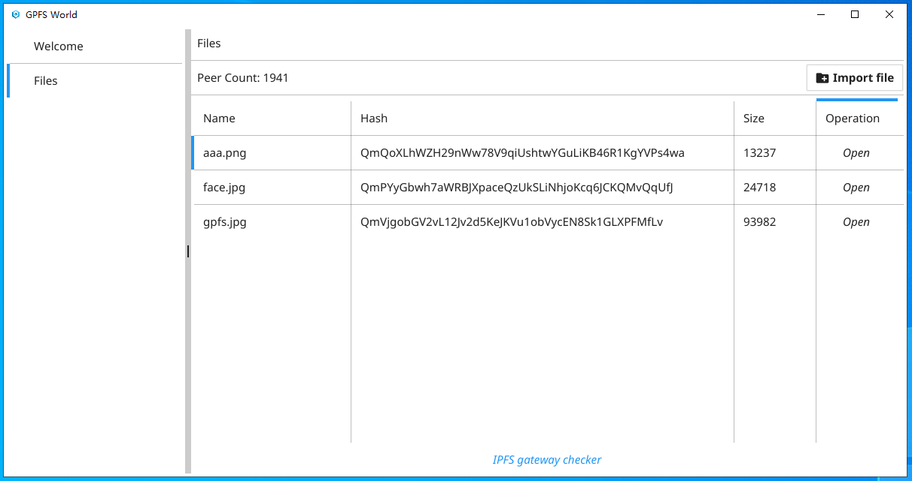

# GPFSWorld 
[简体中文](README_CN.md)

GPFSWorld is developed based on the [fyne](https://github.com/fyne-io/fyne) framework. It is the GUI node of the GPFS network and an integral part of the GPFS ecosystem. Everyone can use it to share their files freely. It is not only a file management tool, it is also a resource search engine based on the P2P protocol.

 

## Function list

| Function            | Statuts         |
| -------------- | ---------- | 
| File import | OK |   
| File export | TODO | 
| Configuration management |TODO |
| Resource search |TODO | 
|  Mining |TODO |

##  Q&A
- Why can't I open the link from the browser after importing the file?   
 Answer: File synchronization takes time, and GFPS (IFPS) gateways are basically abroad. If you can’t open it for a long time, you can choose a suitable gateway here https://ipfs.github.io/public-gateway-checker/ and replace the gateway access in the default link.
  For example, in the following, the same file can use different gateways, as long as the file CID is the same:

     https://infura-ipfs.io/ipfs/QmVjgobGV2vL12Jv2d5KeJKVu1obVycEN8Sk1GLXPFMfLv?filename=gpfs.jpg  
     https://astyanax.io/ipfs/QmVjgobGV2vL12Jv2d5KeJKVu1obVycEN8Sk1GLXPFMfLv?filename=gpfs.jpg  
     https://dweb.link/ipfs/QmVjgobGV2vL12Jv2d5KeJKVu1obVycEN8Sk1GLXPFMfLv?filename=gpfs.jpg  
 
- Can the software be closed when not in use?   
 Answer: Try not to close the file during sharing.
 
- Can others still access my files after the software is closed?  
  Answer: If your files have been synchronized to other nodes, others can still access them even if you shut down or delete the files. However, the GPFS network does not guarantee permanent storage of data, so in order to allow others to access your files continuously, please do not close the software.

